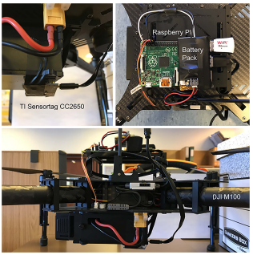
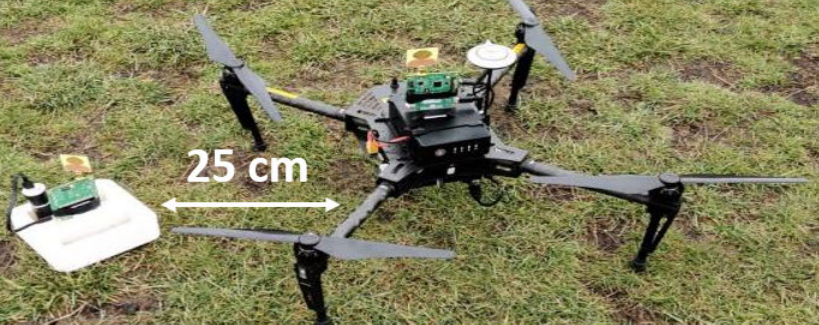

# Imperial-KinoJGM
Code for ICRA 2022 paper - KinoJGM: A framework for efficient and accurate quadrotor trajectory generation and tracking in dynamic environments

Video:

https://user-images.githubusercontent.com/49935737/161355047-9485678f-32f8-456e-abf1-0eeb56ad9ce3.mp4

  
  

## Reference:
[1] Arteaga, Juan M., et al. "Interrogation and Charging of Embedded Sensors by Autonomous Vehicles." 2021 21st International Conference on Solid-State Sensors, Actuators and Microsystems (Transducers). IEEE, 2021.

[2] Qin, Yuan, David Boyle, and Eric Yeatman. "Efficient and reliable aerial communication with wireless sensors." IEEE Internet of Things Journal 6.5 (2019): 9000-9011.
