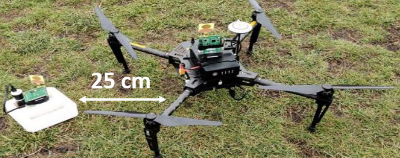
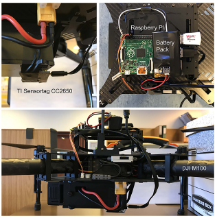

# Imperial-KinoJGM
Code for ICRA 2022 paper - KinoJGM: A framework for efficient and accurate quadrotor trajectory generation and tracking in dynamic environments

video-full.mp4

  
  

## Reference:
[1] Arteaga, Juan M., et al. "Interrogation and Charging of Embedded Sensors by Autonomous Vehicles." 2021 21st International Conference on Solid-State Sensors, Actuators and Microsystems (Transducers). IEEE, 2021.

[2] Arteaga, Juan M., et al. "Interrogation and Charging of Embedded Sensors by Autonomous Vehicles." 2021 21st International Conference on Solid-State Sensors, Actuators and Microsystems (Transducers). IEEE, 2021.
